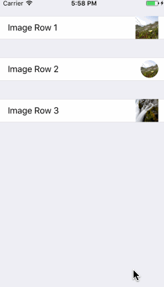

<p align="left">
<a href="https://travis-ci.org/EurekaCommunity/ImageRow"></a>

<a href="https://developer.apple.com/swift"></a>
<a href="https://github.com/Carthage/Carthage"></a>
<a href="https://cocoapods.org/pods/XLActionController"></a>
<a href="https://raw.githubusercontent.com/EurekaCommunity/ImageRow/master/LICENSE"></a>
</p>

By [Xmartlabs SRL](http://EurekaCommunity.com).

## Introduction

ImageRow is a Eureka custom row that allows us to take or choose a picture.



## Usage

```swift
import ImageRow
import Eureka

class ViewController: FormViewController {

    override func viewDidLoad() {
        super.viewDidLoad()


        form +++ Section()
                <<< ImageRow() { row in
                    row.title = "Image Row 1"
                    row.sourceTypes = [.PhotoLibrary, .SavedPhotosAlbum]
                    row.clearAction = .yes(style: UIAlertActionStyle.destructive)
                }
             +++
                 Section()
                <<< ImageRow() {
                    $0.title = "Image Row 2"
                    $0.sourceTypes = .PhotoLibrary
                    $0.clearAction = .no
                }
                .cellUpdate { cell, row in
                    cell.accessoryView?.layer.cornerRadius = 17
                    cell.accessoryView?.frame = CGRect(x: 0, y: 0, width: 34, height: 34)
                }
             +++
                 Section()
                    <<< ImageRow() {
                        $0.title = "Image Row 3"
                        $0.sourceTypes = [.PhotoLibrary, .SavedPhotosAlbum]
                        $0.clearAction = .yes(style: .default)
                    }
    }
}

```

## Requirements

* iOS 8.0+
* Xcode 8.0+
* Eureka 2.0.*

## Getting involved

* If you **want to contribute** please feel free to **submit pull requests**.
* If you **have a feature request** please **open an issue**.
* If you **found a bug** or **need help** please **check older issues, [FAQ](#faq) before submitting an issue.**.

Before contribute check the [CONTRIBUTING](https://github.com/EurekaCommunity/ImageRow/blob/master/CONTRIBUTING.md) file for more info.

If you use **ImageRow** in your app We would love to hear about it! Drop us a line on [twitter](https://twitter.com/xmartlabs).

## Examples

Follow these 3 steps to run Example project: Clone ImageRow repository, run `carthage update` from project root folder, open ImageRow workspace and run the *Example* project.

You can also experiment and learn with the *ImageRow Playground* which is contained in *ImageRow.workspace*.

## Installation

#### CocoaPods

[CocoaPods](https://cocoapods.org/) is a dependency manager for Cocoa projects.

To install ImageRow, simply add the following line to your Podfile:

```ruby
pod 'ImageRow', '~> 1.0'
```

#### Carthage

[Carthage](https://github.com/Carthage/Carthage) is a simple, decentralized dependency manager for Cocoa.

To install ImageRow, simply add the following line to your Cartfile:

```ogdl
github "EurekaCommunity/ImageRow" ~> 1.0
```

## Customization

ImageRow has 2 properties to customize:

* `sourceTypes` which allows us to specify the source of the picture. It could be .PhotoLibrary, .Camera, .SavedPhotosAlbum, or any combination of the previous values since `sourceTypes` property type is `ImageRowSourceTypes` which conforms to `OptionSet`.
* `clearAction` let's us add a clear action sheet option  and configure its style. Possible values are: `.no` or `.yes(style: UIAlertActionStyle)`. Notice that .yes value requires we pass a `UIAlertActionStyle` style. 

## Author

* [Xmartlabs SRL](https://github.com/xmartlabs) ([@xmartlabs](https://twitter.com/xmartlabs))

## FAQ

no content yet

# Change Log

This can be found in the [CHANGELOG.md](CHANGELOG.md) file.
